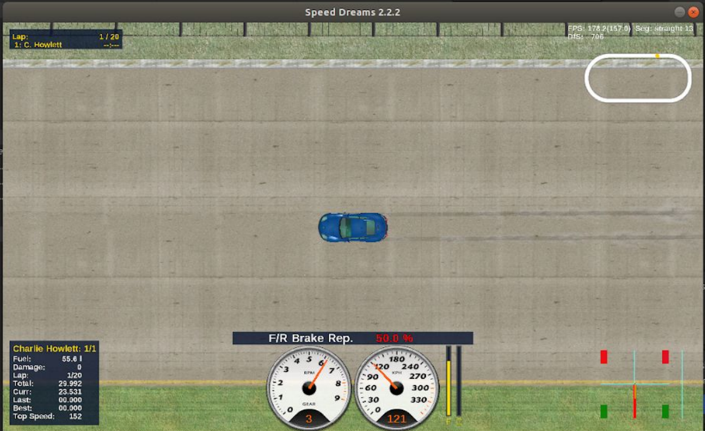

One project I still think about from university is the anti-lock braking system I built for my dissertation, and the Speed Dreams driver I later used to test it in a more realistic environment. The driver project was not a standalone idea so much as an extension of my earlier [anti-lock-braking-system](https://github.com/mrchazaaa/anti-lock-braking-system) library. That earlier project focused on the controller itself; the Speed Dreams work gave me a way to plug it into a vehicle simulation and observe how it behaved under actual braking scenarios.

The main goal of the dissertation was to build an ABS implementation that resembled the behaviour of commercial systems closely enough to be useful for research and experimentation. I based the control loop on a Bosch-style ABS cycle described in the literature, then filled in a key missing piece myself: vehicle speed estimation under heavy braking, where wheel speeds alone stop being reliable. For that I used an Extended Kalman Filter, which made the project as much about estimation and modelling as it was about control logic.

Choosing the simulation environment was a significant part of the work. Rather than build a vehicle model from scratch, I used Speed Dreams because it exposed individual wheel braking and had a more realistic physics model than a lot of the open-source alternatives I looked at. That mattered because the quality of the ABS is only as convincing as the environment testing it. The driver let me run controlled braking sequences, compare estimated vehicle speed against simulated ground truth, and inspect how brake commands and slip values changed over time across all four wheels.

What I like about this pair of projects is the separation of concerns. The ABS library stands on its own as a reusable controller with tests and a small API, while the Speed Dreams driver acts as a practical harness for validation. That split made the work easier to reason about and, in hindsight, reflects a pattern I still value: isolate the core logic, then build tooling around it that makes the system observable. The results were promising rather than perfect, which was an honest outcome. The controller showed sensible slip regulation, the estimator converged reasonably well, and the gaps that remained were clear enough to point to worthwhile future improvements.

[View the Speed Dreams driver on GitHub](https://github.com/Mrchazaaa/abs-speed-dreams-driver)
[View the ABS library on GitHub](https://github.com/mrchazaaa/anti-lock-braking-system)
[Read the dissertation](https://charliehowlett.co.uk/ABSConstruction.pdf)
