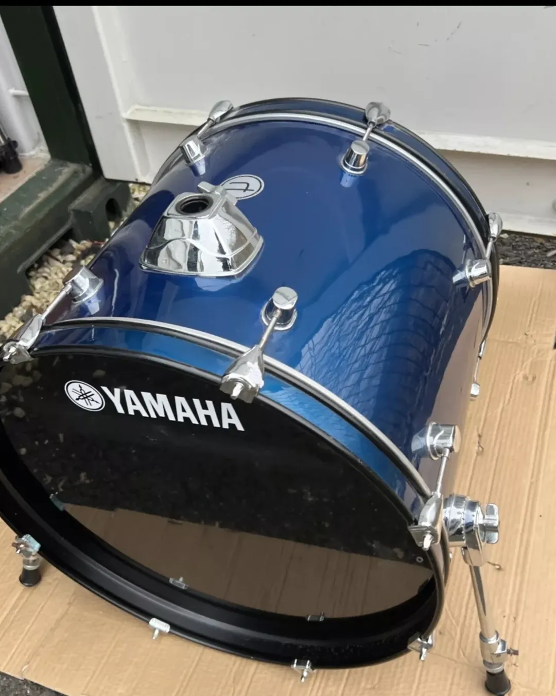
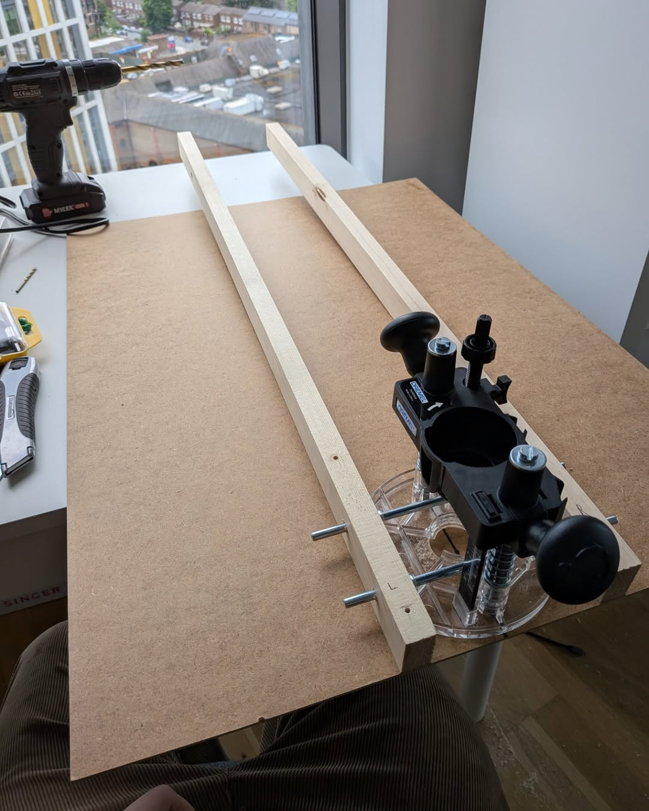
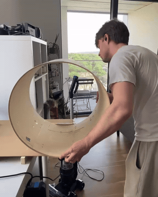
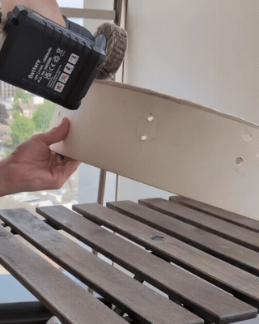
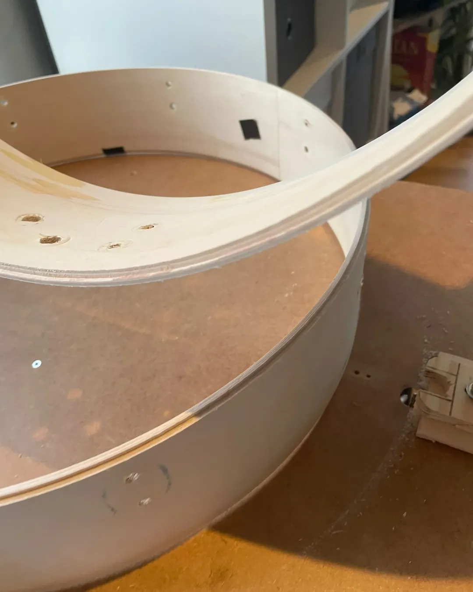
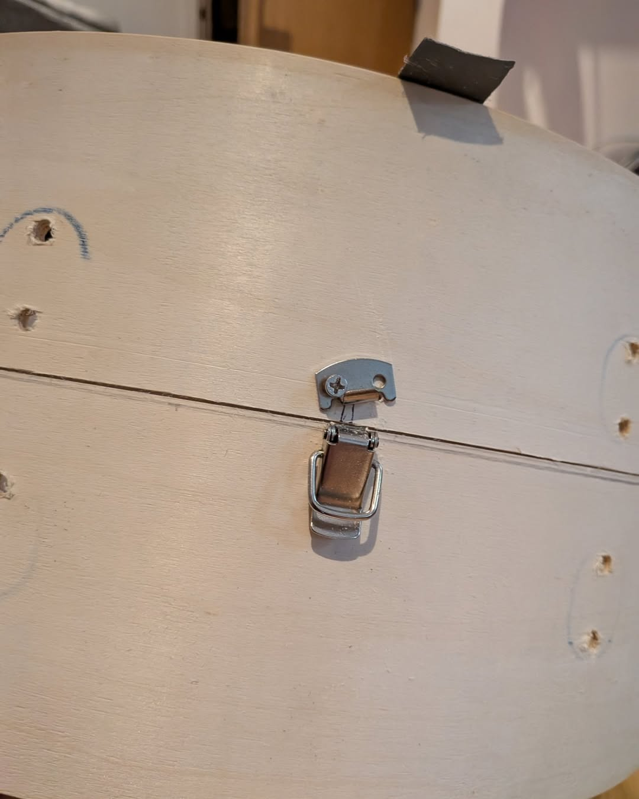
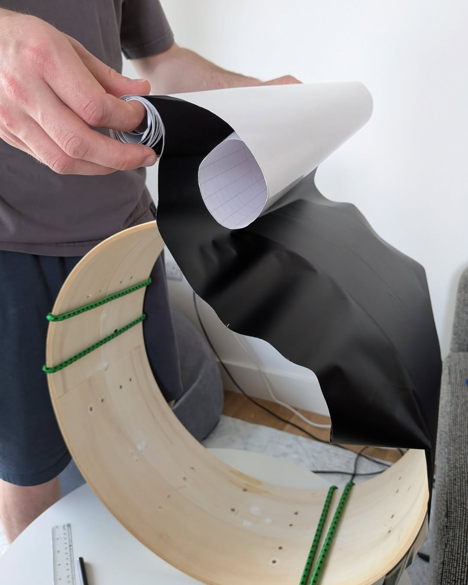
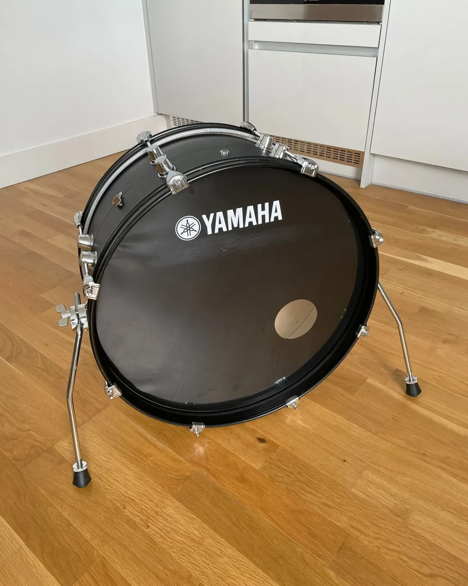
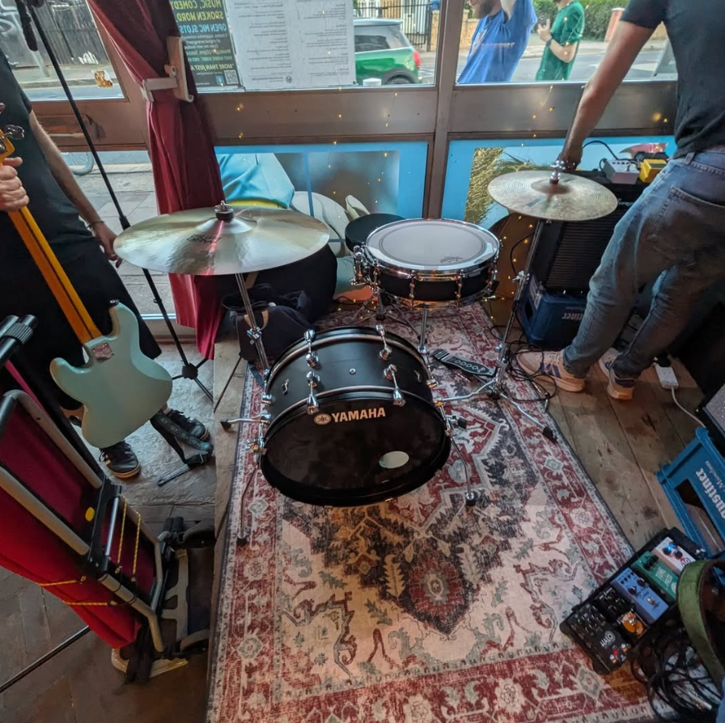

As an amateur drummer, I often play shows where I have to bring my own drum kit to the venue, which is particularly challenging because I do not have a car. Loading a full-size kit in and out of gigs is labour intensive, and the idea of taking one on the Underground is unrealistic.

That led me to nesting kits: drum kits designed so the shells split open and pack inside one another like Russian dolls, making them much easier to transport. However, the ones I had seen on eBay were always prohibitively expensive, so I decided to try making my own.

I bought a cheap old bass drum with a fairly specific goal in mind: turn it into a nesting drum that would be much easier to transport without compromising too much on sound. I wanted something compact enough to be practical, but still usable as a proper gigging bass drum. Below you can see the finished product.



**1. The original drum as bought.**

This is the cheap second-hand bass drum I started from, complete with the original blue wrap and tom mount, before any serious cutting or refinishing work began.

**2. Building a cutting jig.**

I do not have any expensive benchtop woodworking tools, so I made a simple router jig that clamped to the side of a table and let me cut a clean, level line all the way around the shell.

**3. Cutting the shell in two.**

This clip shows the point I started cutting. This step  was extremely loud and, in the end, not especially accurate. As I rotated the drum, it occasionally slipped, which created an uneven edge that I had to correct later with a lot of sanding. If I did this again, I would probably cut the shell with a handsaw instead and save my neighbours the noise.

**4. High point sanding.**

As mentioned above, I discovered that my jig was incredibly inaccurate when it came to cutting a straight line all the way around the drum. To fix that, I first removed the high points from the shell with a hand-held drill and a sanding attachment.

**5. Further sanding.**

After removing the higher points along the rim of each half, I sanded the entire edge with finer sandpaper on a flat surface to get it properly level.

**6. Cutting the lip.**

Next, I reused my cutting jig with a hacked-together guard to remove a thin strip of material along the edge of each half, creating two interlocking rims so the drum would fit together neatly like a jigsaw puzzle.

Overall, I am quite happy with how the interlocking rims turned out.

**7. Adding closure hardware.**

At this point I fitted three latches around the shell so the two halves could be secured together.

**8. Wrapping the rebuilt shell.**

Once the structure was working, I rewrapped the drum in black to give it a cleaner final finish.

**9. The completed nesting drum.**

This final photo shows the drum reassembled, with the compact shell format hidden inside a much cleaner finished build. It does exactly what I wanted: it is far more portable, but it still sounds like a proper bass drum.

**10. First gig with the finished kit.**

This photo shows the drum at it's first gig: a compact live setup where floor space and portability matter.

It ended up sounding great for its size and, with the addition of ultra-lightweight hardware, it became much more portable than my usual setup. I could fit the snare and cymbals inside the bass drum and carry the rest of the hardware in a second bag, which made getting to gigs much more manageable. I learned a lot during this project, especially about where accuracy matters and where a rougher approach is good enough, and I will definitely make another drum like this in the future.

I post more of my drumming projects and playing on [Instagram](https://www.instagram.com/charliesdrummin).
