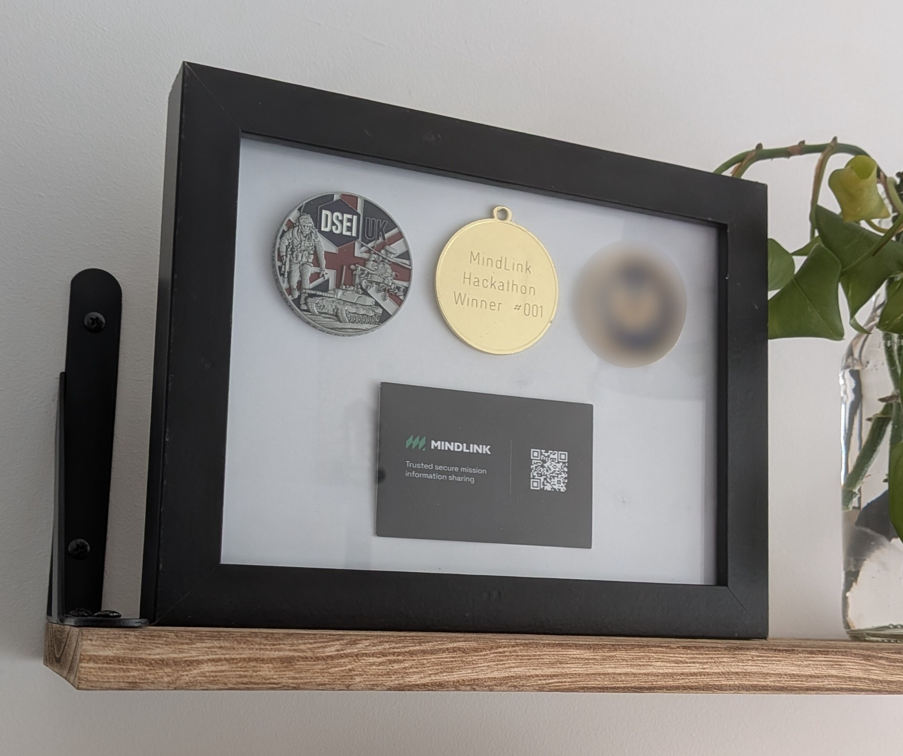

For software engineers, the ethereal nature of our work often means we're left without many physical reminders that it ever happened. That can make it surprisingly hard to look back and celebrate what we've actually done, especially after constantly moving from one project to the next. I've certainly felt that myself, so I've made a point of holding on to a few keepsakes over the years. After finding several of them during a recent spring clean, I decided to turn them into a display for my office shelf.

The piece features:
- A commemorative DSEI UK coin which I received while representing MindLink at the convention in 2025.
- A first place medal from the first ever MindLink Hackathon.
- A MindLink business card featuring our freshly revamped design.
- A commemorative challenge coin from one of our customers (censored in this image due to the confidential nature of our work).

I like projects like this because they give physical form to work that is usually invisible. Most of my six years at MindLink now live in old documents, pull requests, and production systems; this is a reminder that the best parts of the job are also personal: growth, collaboration, and pride in building something worthwhile.
