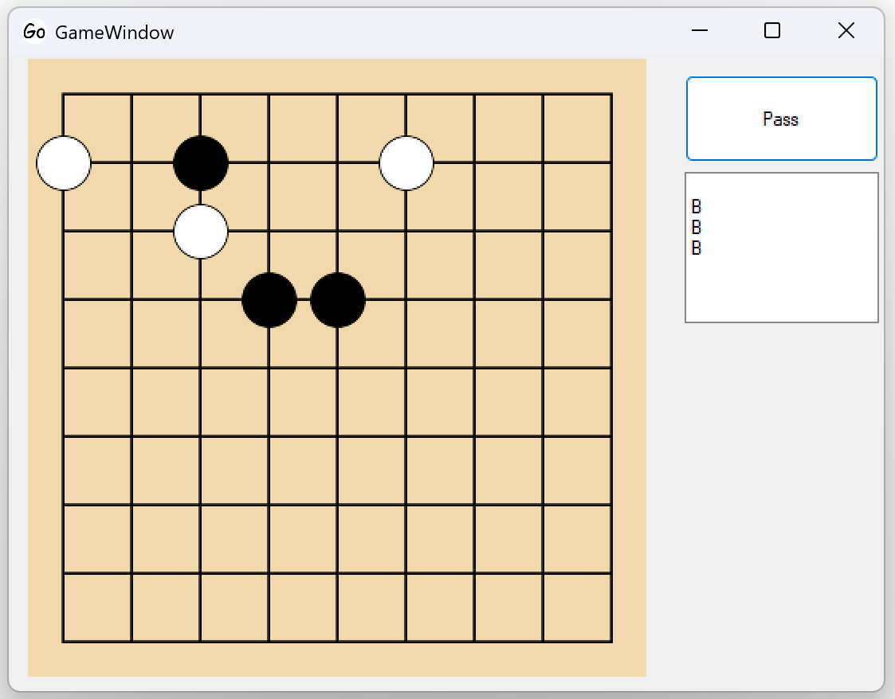
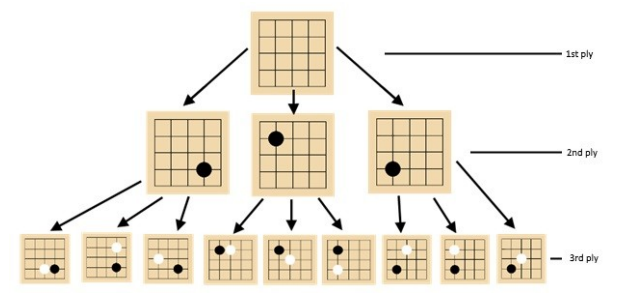

One of the earliest substantial software projects I finished on my own was a Go-playing bot I built for my EPQ. I chose it because Go sits in an awkward place for computers: the rules are simple, but the search space is huge, and naive brute force breaks down very quickly. That made it a good project for learning how to turn research papers into working code rather than just assembling a UI around a straightforward problem.

I built the application as a WinForms desktop app in C#, with support for different board sizes, configurable thinking time, and move history so positions could be replayed and inspected. The interesting part was the engine underneath it. I implemented Monte Carlo Tree Search, then extended it with UCT for balancing exploration against exploitation and RAVE to share information about promising moves across the tree. For a solo project at that stage, a lot of the work was not the headline algorithm but the plumbing around it: board representation, legal move generation, capture logic, scoring, and tree bookkeeping that did not collapse under repeated simulation.

What I remember most is how quickly the theoretical ideas ran into practical constraints. Random playouts were easy to implement but weak at representing actual Go strategy, so the bot could make sensible local decisions while still missing the bigger picture. I also had to deal with awkward edge cases like Ko, where repeated board states can trap a simulation indefinitely, and with the broader question of when a simulated game should really end. Those problems taught me something useful very early: getting an algorithm "working" is not the same as getting a system to behave robustly.

The final program was nowhere near professional strength, but that was never really the point. What mattered was that it could make coherent decisions, beat a purely random player, and give me a concrete way to study search heuristics, tradeoffs in evaluation, and performance limitations. It is still a project I look back on because it taught me how to work from incomplete understanding, test ideas empirically, and be honest about the gap between a clean academic description and a reliable implementation.

[View the project on GitHub](https://github.com/Mrchazaaa/monte-carlo-go)
[Read the EPQ report](https://charliehowlett.co.uk/EPQReport.pdf)
