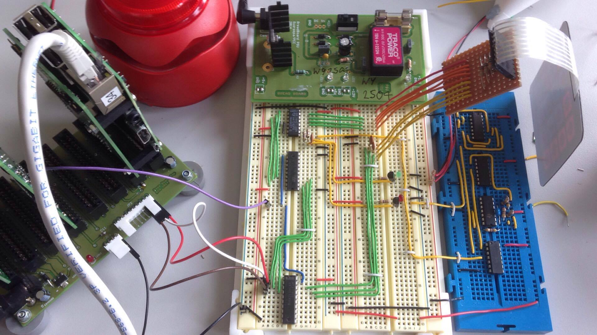

One of my earliest university projects was a group assignment in first year where we were asked to design and build a Raspberry Pi based digital lock. The brief sounds simple in hindsight, but it was a good introduction to the fact that even small embedded systems become more interesting once they have to deal with real inputs, user feedback, and awkward implementation constraints.

The main constraint I remember was that we were not allowed to rely on interrupt-driven input for the membrane keypad. Instead, we had to detect key presses by polling the Pi's pins and working through the keypad matrix ourselves. That made the input side more hands-on than a lot of beginner hardware projects. On top of the basic four-digit passcode entry, we added status LEDs for correct and incorrect codes, a short delay after failed attempts to make brute forcing less practical, and a text-based interface for changing settings once the user had gained access.

We also went a bit further than the minimum brief. We added a piezo buzzer that could play short tunes after a successful unlock, and, more interestingly, we wrote software to attack our own system by generating electrical signals that mimicked key presses. I still like that detail because it pushed the project slightly beyond "make the lock work" and into "think about how the design can fail". Even at that scale, it was a useful lesson in treating implementation and testing as part of the same exercise.

For a first-year team project, it covered a good spread of things I still enjoy: low-level I/O, simple security logic, physical hardware integration, and a bit of interface design. It also ended up being robust enough that a lecturer asked us to show it on university open days afterwards, which was a satisfying sign that we had built something more polished than a throwaway coursework demo.

[View the project on GitHub](https://github.com/barankiewicz/PROM_keypad)
